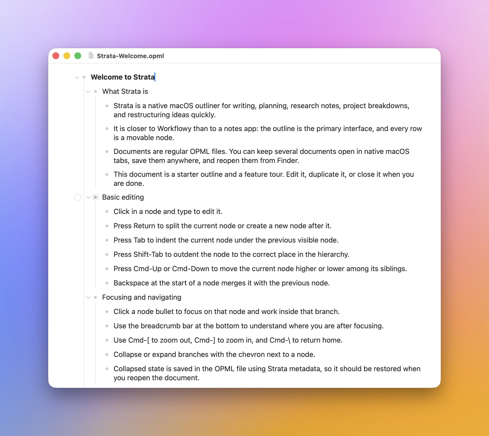

# Strata

Strata is a native macOS outliner for writing, thinking, planning, and restructuring ideas quickly. It is inspired by tools like Workflowy, but built as a document-based Mac app with OPML files, native windows, native tabs, and standard keyboard shortcuts.



## Features

- Open and save regular `.opml` documents.
- Keep multiple documents open in native macOS tabs.
- Focus on any node and navigate back with breadcrumbs.
- Select one or many nodes with keyboard or mouse.
- Copy, cut, paste, delete, complete, merge, reorder, indent, outdent, and drag selected nodes.
- Use rich inline formatting: bold, italic, highlight, and URL links.
- Type Markdown-like shortcuts such as `**bold**`, `*italic*`, and `==highlight==`; Strata converts them to rich text and removes the markers.
- Hide completed items from the View menu.
- Search the current outline.
- Export as plain text, Markdown, or HTML.

## Download

Download the latest build from [GitHub Releases](https://github.com/ymolodtsov/strata/releases).

Strata currently targets macOS 26 and later.

## Opening an Unsigned Build

Strata is not signed with a paid Apple Developer account yet. macOS Gatekeeper may block it the first time you open it.

If macOS says the app cannot be opened:

1. Open **System Settings**.
2. Go to **Privacy & Security**.
3. Scroll to the security message about Strata.
4. Click **Open Anyway**.

You can also Control-click `Strata.app`, choose **Open**, then confirm that you want to open it.

## File Format

Strata uses OPML as its primary file format. It stores Strata-specific state using custom OPML attributes:

- `_complete="true"` for completed nodes.
- `_collapsed="true"` for collapsed branches.
- `_strata_formatting="..."` for rich-text formatting and links.
- `_note="..."` for node notes.

Other OPML apps should still be able to read the outline text, though they may ignore Strata-specific metadata.

## Build From Source

Requirements:

- macOS 26 or later
- Xcode with the macOS 26 SDK

Build a release app:

```sh
xcodebuild -project Strata.xcodeproj -scheme Strata -configuration Release -derivedDataPath build/DerivedData build
```

The built app will be at:

```sh
build/DerivedData/Build/Products/Release/Strata.app
```

## Status

Strata is early software. Core outlining behavior is in place, but polish and native document behavior are still being refined.
